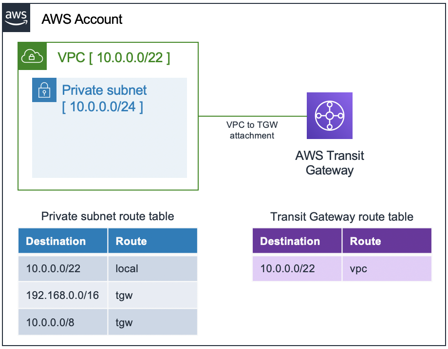

# new-VPC-tgw
script+template for new vpc with cross account tgw route and lambda to add routes to vpc/subnet table

# CloudFormation Custom Resource: new vpc with cross account tgw

- [Getting Started](#getting-started)
- [Pre-Requisites](#pre-requisites)
- [Bash script](#bash-script)
  - [SH Parameters](#sh-parameters)
- [CloudFormation](#cloudformation)
  - [CFN Parameters](#cfn-parameters)
  - [CFN Resources](#cfn-resources)
  - [CFN Outputs](#cfn-outputs)
  - [CFN Custom Resource](#cfn-custom-resource)
- [Deployment](#deployment)

## Getting Started

These instructions will let you deploy a VPC a subnet with a route table with a route to a Transit Gateway. Since CloudFormation currently does not support TGW destination in a route of an EC2 route tables, this CFN template includes a lambda (developed in Python) that handle a CFN custom resource to manage the Transit Gateway destination.

## Pre-requisites

- An S3 bucket in the same region where you are going to deploy the CloudFormation stack. The S3 bucket is needed by Serverless Transform section of this template to deploy the custom resource handled by the lambda function.

- AWS CLI configured with IAM AccessKey and SecretKey in order to deploy the CloudFormation template.

## Bash script

The bash script is useful to package and deploy the CloudFormation template. The package command will build the lambda package with the code available in `/py` folder. The deploy package will build the CFN stack in the configured AWS account and region within the CLI.

### SH Parameters

- `PROFILE_NAME`: name of the profile used by the awscli
- `TEMPLATE`: name of the CloudFormation template
- `TEMPLATE_DEPLOY`: name of the CloudFormation template after the packaging and ready to be deployed. 
- `S3_BUCKET`: name of the bucket inside you will use as a temporary bucket in order to host the Lambda code and the packaged CloudFormation template.
- `S3_PREFIX`: prefix to be used in the S3 bucket.
- `STACK_NAME`: name of the CloudFormation stack you want to deploy in your AWS account.

## CloudFormation

### CFN Parameters

- `VPCCIDR`: CIDR block of the deployed VPC
- `SubnetCIDR`: CIDR block of the subnet in the VPC
- `TGWCIDR1`: First CIDR block that will be the destination for traffic to be routed to the Transit Gateway.
- `TGWCIDR2`: Second CIDR block that will be the destination for traffic to be routed to the Transit Gateway.

### CFN Resources

- MyTransitGateway: an `AWS::EC2::TransitGateway` where the routes will redirect the interested traffic.
- MyVPC: an `AWS::EC2::VPC` where the subnet a related route table will be deployed.
- MySubnet: a `AWS::EC2::Subnet` in the above mentioned VPC
- MyTransitGatewayAttachment: the `AWS::EC2::TransitGatewayAttachment` that link the VPC to the Transit Gateway
- MyRouteTable: the `AWS::EC2::RouteTable` that will be used by the deployed subnet
- SubnetRouteTableAssoc: `AWS::EC2::SubnetRouteTableAssociation` between the route table and the deployed subnet
- CustomResourceRole: `AWS::IAM::Role` for the lambda function that will handle the custom resource.
- TGWRoute: a `AWS::Serverless::Function` that handles the CloudFormation custom resource.
- RouteToTGW1: the first instance of the custom resource. A `Custom::EC2Route` that add a route to the Transit Gateway in the route table of the subnet.
- RouteToTGW2: second instance of the `Custom::EC2Route` custom resource. See [CFN Custom Resource](#cfn-custom-resource) paragraph for details. 

### CFN Outputs

- MyTransitGatewayId: id of the deployed Transit Gateway.
- MyVpcId: id of the deployed VPC.
- MySubnetId: id of the deployed subnet within the VPC.
- MyRouteTableId: id of the route table attached to the deployed subnet.

### CFN Custom Resource

- Type: `Custom::EC2Route`
- DependsOn: provide the resource name of the `AWS::EC2::TransitGatewayAttachment` that actually link the VPC to the Transit Gateway. The EC2 Route can be deployed only after the attachment.
- Properties:
  - ServiceToken - (*string*) - [**REQUIRED**] - Specifies where AWS CloudFormation sends requests to. In this case is the ARN of the Lambda function that handles the custom resource: `!GetAtt 'TGWRoute.Arn'`
  - TransitGatewayId (*string*) - [**REQUIRED**] - The ID of the transit gateway.
  - DestinationCidrBlock (*string*) - [**REQUIRED**] - The CIDR block you want to be handle by the targeted Transit Gateway.
  - RouteTableId (*string*) - [**REQUIRED**] - The ID of the EC2 Route Table where you want to add the route.

## Deployment

1. Configure the CloudFormation template parameters.
2. Configure the bash script parameters.
3. Run the bash script.
4. Check the CloudFormation console in your AWS account.
